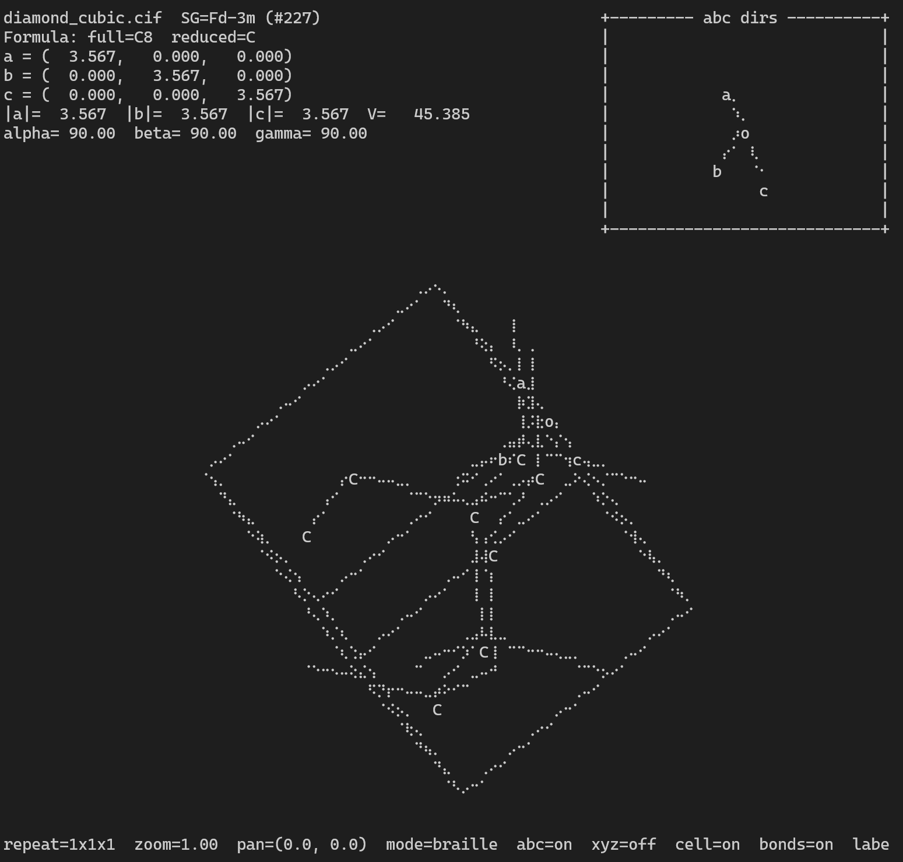

# xtalui

[](https://github.com/bonan-group/xtalui/actions/workflows/ci.yml)
[](https://pypi.org/project/xtalui/)

`xtalui` is a terminal-first crystal structure viewer for atomistic and crystalline structures.



It renders structures directly in the terminal using:

- ASCII, Unicode, and Braille rendering for cell edges, bonds, and atoms
- depth-aware atom glyphs or element labels
- interactive camera controls without launching a GUI
- a single-command CLI: `xtal STRUCTURE_FILE [STRUCTURE_FILE ...]`

## Features

- Load structures through ASE
- Load self-contained ABACUS `STRU` files with explicit `LATTICE_VECTORS`
- Load multi-frame structure series supported by ASE
- Accept multiple input files and concatenate all frames into one trajectory series
- Show atoms, bonds, and the unit cell in the terminal
- Toggle between point and sphere atom rendering
- Display chemical formula, lattice vectors, cell lengths and angles, volume, and space group
- Show both lattice-frame `a/b/c` and Cartesian `x/y/z` direction widgets
- Show atomic positions and bond lengths in scrollable overlay panels
- Calibrate the terminal aspect ratio with a Braille circle test pattern
- Toggle labels, bonds, cell frame, color, sphere mode, and direction panels at runtime
- Autoplay continuous rotation directly in the terminal
- Autoplay multi-frame structure series directly in the terminal
- Align the view along `x`, `y`, or `z` with one keypress

## Installation

Recommended for daily use: install `xtal` as a standalone `uv` tool so it is not tied to a project virtual environment.

Once the package is published on PyPI:

```bash
uv tool install xtalui
```

Directly from GitHub:

```bash
uv tool install git+https://github.com/bonan-group/xtalui
```

Standard `pip` installation from PyPI:

```bash
python -m pip install xtalui
```

Standard `pip` installation directly from GitHub:

```bash
python -m pip install git+https://github.com/bonan-group/xtalui
```

From a local checkout:

```bash
git clone https://github.com/bonan-group/xtalui.git
cd xtalui
uv tool install --editable .
```

Local editable install with standard `pip`:

```bash
git clone https://github.com/bonan-group/xtalui.git
cd xtalui
python -m pip install -e .
```

If `xtal` is not yet on your `PATH`, run:

```bash
uv tool update-shell
```

Then you can launch the viewer directly:

```bash
xtal examples/silicon_diamond.cif
```

For development work inside the repository:

```bash
uv venv --python /usr/bin/python3 .venv
uv sync --extra dev
```

You can also run it without activating the environment:

```bash
uv run xtal --help
uv run python -m xtalui --help
```

## Development

```bash
uv sync --extra dev
uv run pytest -q
uv run ruff check .
uv run ruff format --check .
```

## Usage

```bash
uv run xtal structure.cif
uv run xtal frame1.xyz frame2.xyz
uv run xtal POSCAR --repeat 2 2 1
uv run xtal structure.cif --symprec 1e-3
uv run xtal structure.cif --color
uv run xtal STRU
```

The repository also ships with generated sample structures:

```bash
uv run xtal examples/silicon_diamond.cif
uv run xtal examples/gaas_zincblende.cif
uv run xtal examples/graphite_hexagonal.cif
```

## CLI Options

- `PATH`: one or more structure files to open with ASE
- If multiple paths are given, all frames from all files are concatenated into one trajectory series in the order provided
- `--repeat NX NY NZ`: repeat the structure along each lattice direction
- `--hide-cell`: start with the unit cell hidden
- `--symprec FLOAT`: set the symmetry tolerance used for space-group detection
- `--color`: start with element colors enabled

## Controls

- `Left` / `Right`: rotate around Y
- `Up` / `Down`: rotate around X, or scroll the active overlay panel when one is open
- `x` / `y` / `z`: align the view along the Cartesian axes
- `a`: toggle automatic rotation
- `p`: toggle the atomic positions overlay
- `B`: toggle the bond-length overlay
- `t`: toggle automatic frame playback for multi-frame series
- `T`: toggle calibration mode
- `rXYZ`: rebuild the displayed structure as an in-app `XxYxZ` supercell, for example `r222`
- `[` / `]`: move backward or forward through a loaded structure series
- `j` / `k`: scroll the active overlay panel down or up
- `1`: toggle the `abc dirs` panel
- `2`: toggle the `xyz dirs` panel
- `Shift+Left` / `Shift+Right`: pan X
- `Shift+Up` / `Shift+Down`: pan Y
- `+` / `-`: zoom in/out
- `m`: toggle line mode between Braille and Unicode wireframe
- `b`: toggle bonds
- `c`: toggle unit cell
- `C`: toggle element colors
- `s`: toggle sphere mode for atoms
- `Left` / `Right` or `+` / `-` in calibration mode: decrease or increase the render aspect ratio
- `Ctrl-R`: reset the view camera and restore the launch repeat
- `l`: toggle labels
- `Esc`: cancel an in-progress repeat command
- `?`: toggle help
- `q`: quit

## Calibration

Press `T` to enter calibration mode. The main view is replaced by a Braille-rendered circle.

Adjust the aspect ratio with:

- `Left` / `Right`
- `+` / `-`

until the circle looks round in your terminal and font. The current value is shown in the footer as `aspect=...`.

Press `T` again to return to the structure view. The calibrated aspect ratio is then used by:

- the main crystal renderer
- the `abc dirs` panel
- the `xyz dirs` panel

## Overlay Panels

Press `p` to show atomic positions for the current frame. The table includes:

- atom index
- element symbol
- Cartesian coordinates
- direct (fractional) coordinates

Press `B` to show the bond-length overlay. Each row lists:

- the full indices of both atoms in the bond
- the bond length
- the periodic image offset used for that displayed bond

Both overlays are scrollable with:

- `Up` / `Down`
- `j` / `k`

The overlays are drawn over the main view, so opening them does not rescale the structure display.

## Atom Rendering

By default, atoms are shown as points. Press `s` to switch to sphere mode.

- In Unicode mode, spheres use a constant filled-circle glyph
- In Braille mode, spheres are rasterized on the Braille subcell grid
- In label mode, element labels are still drawn on top of the spheres

## Notes

- The Python package name is `xtalui`, while the installed CLI command is `xtal`.
- Space-group detection uses `spglib` through ASE-compatible structure data.
- Bond detection follows the ASE GUI heuristic: a periodic neighbor list with a `1.5x` covalent-radius cutoff.
- Color mode uses ASE Jmol-style element colors for atoms and atom labels.
- ABACUS `STRU` support is built in for files that include explicit `LATTICE_VECTORS`.
- `STRU` files that rely on `LATTICE_PARAMETER(S)` plus `latname` from a separate `INPUT` file are not supported.
- Braille mode is the default line renderer because it provides smoother terminal line quality.
- Example CIF files in [`examples/`](/home/bonan/appdir/atomtui/examples) are generated with ASE for common crystal prototypes.

## Release

Releases are tag-driven:

```bash
git tag v0.1.0
git push origin v0.1.0
```

The GitHub release workflow validates that the tag matches `project.version`, builds the package, publishes a GitHub Release, and uploads to PyPI.
